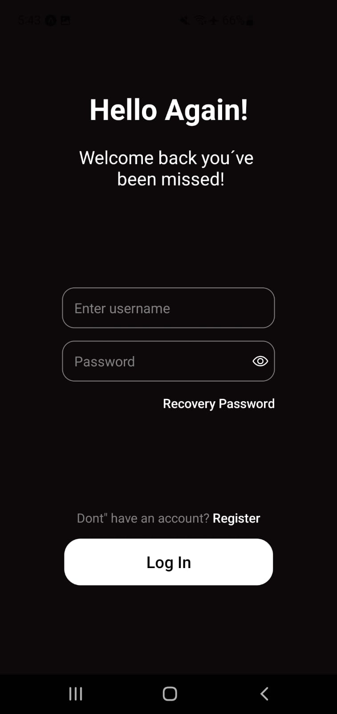
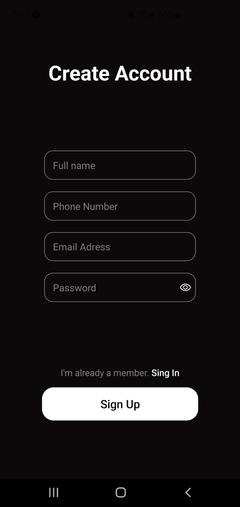
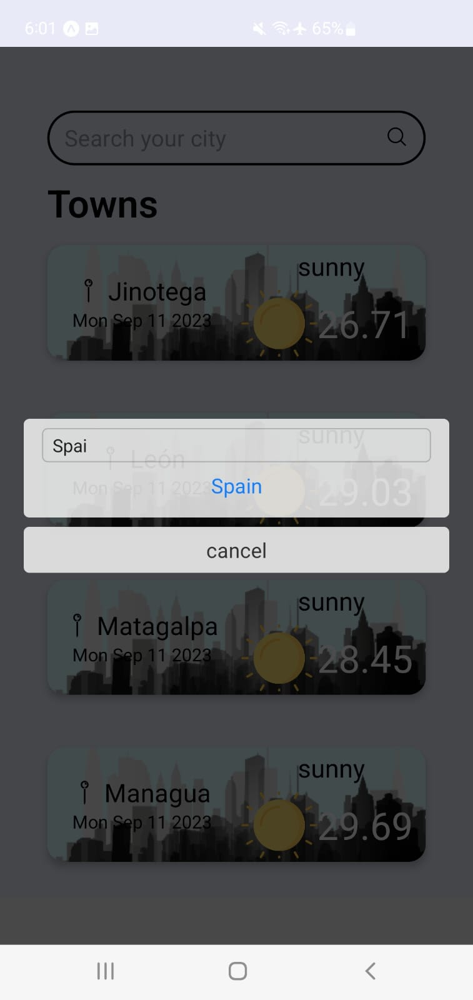
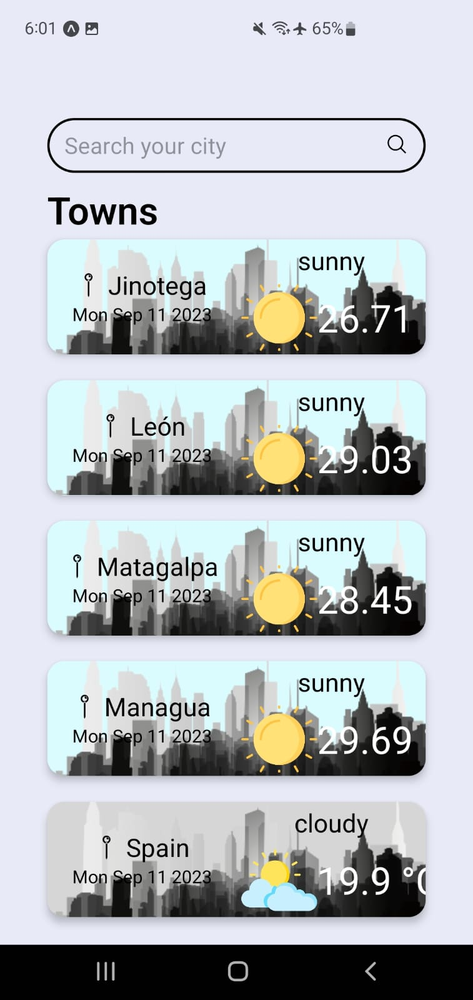

# Weather App

First application with react native, it has 4 screens, I use a weather api, and I also make queries with the debounce method of javascript.

---

## Technologies

A list of technologies used within the project:

- [React Native](https://reactnative.dev/): 0.71.8
- [Expo](https://docs.expo.dev/) 48.0.9


---

### ScreenShot







---
## Installation

A little intro about the installation. You need to have node and expo installed.

```
git clone https://github.com/Dalex19/weather-app.git
cd directory
yarn i
npx expo start
scan qr with you phone
```